

<picture>
  <source media="(prefers-color-scheme: dark)" srcset="assets/banner-dark.svg">
  <source media="(prefers-color-scheme: light)" srcset="assets/banner-light.svg">
  
</picture>

<picture>
  <source media="(prefers-color-scheme: dark)" srcset="assets/typing-dark.svg">
  <source media="(prefers-color-scheme: light)" srcset="assets/typing-light.svg">
  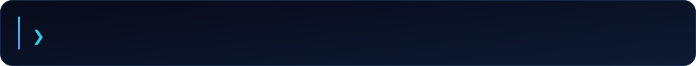
</picture>

 

<picture>
  <source media="(prefers-color-scheme: dark)" srcset="assets/divider-dark.svg">
  <source media="(prefers-color-scheme: light)" srcset="assets/divider-light.svg">
  
</picture>

<picture>
  <source media="(prefers-color-scheme: dark)" srcset="assets/hdr-about-dark.svg">
  <source media="(prefers-color-scheme: light)" srcset="assets/hdr-about-light.svg">
  
</picture>

- 🛠 **独立开发者** —— 习惯一个人把一个想法从原型推到能上线的产品
- 📱 主力技术栈 **Flutter / Dart**，以 Android 端为主，必要时下沉到原生；服务端写 **Go / Python**
- 🔒 相信工具该在**本地**解决问题：小鲸鱼的解析全程跑在手机上，链接不经过任何第三方服务器
- 🧪 喜欢把踩过的坑沉淀成能复用的方案，而不是一次性脚本
- 🚀 信奉「**先做出来，再做好**」
- 📫 交流走 Issue 就行，每个仓库都开着

<picture>
  <source media="(prefers-color-scheme: dark)" srcset="assets/terminal-dark.svg">
  <source media="(prefers-color-scheme: light)" srcset="assets/terminal-light.svg">
  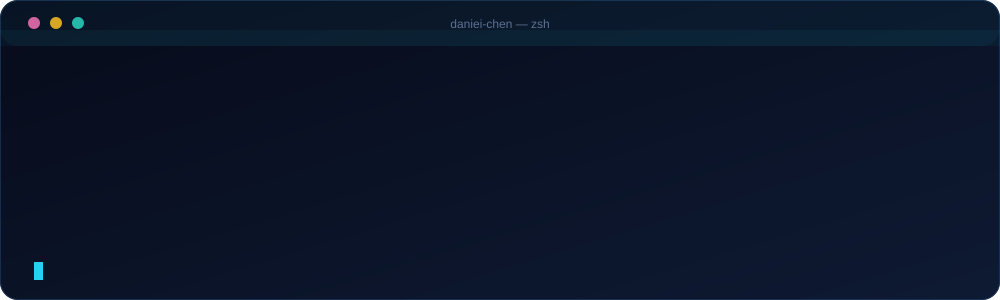
</picture>
<picture>
  <source media="(prefers-color-scheme: dark)" srcset="assets/hdr-stack-dark.svg">
  <source media="(prefers-color-scheme: light)" srcset="assets/hdr-stack-light.svg">
  
</picture>

<picture>
  <source media="(prefers-color-scheme: dark)" srcset="assets/lang-dark.svg">
  <source media="(prefers-color-scheme: light)" srcset="assets/lang-light.svg">
  
</picture>

<table>
<tr>

<td valign="top" width="50%">

**框架与运行时**

</td>

<td valign="top" width="50%">

**服务端与工程**

</td>

</tr>
</table>
<picture>
  <source media="(prefers-color-scheme: dark)" srcset="assets/hdr-projects-dark.svg">
  <source media="(prefers-color-scheme: light)" srcset="assets/hdr-projects-light.svg">
  
</picture>

  <a href="https://github.com/daniei-chen/Little-Whale">
    <picture>
      <source media="(prefers-color-scheme: dark)" srcset="assets/proj-littlewhale-dark.svg">
      <source media="(prefers-color-scheme: light)" srcset="assets/proj-littlewhale-light.svg">
      
    </picture>
  </a>

  <a href="https://github.com/daniei-chen/WorkBuddy-API">
    <picture>
      <source media="(prefers-color-scheme: dark)" srcset="assets/proj-workbuddyapi-dark.svg">
      <source media="(prefers-color-scheme: light)" srcset="assets/proj-workbuddyapi-light.svg">
      
    </picture>
  </a>

  <a href="https://github.com/daniei-chen/solar-system">
    <picture>
      <source media="(prefers-color-scheme: dark)" srcset="assets/proj-solarsystem-dark.svg">
      <source media="(prefers-color-scheme: light)" srcset="assets/proj-solarsystem-light.svg">
      
    </picture>
  </a>

  <a href="https://github.com/daniei-chen/ZCode-App">
    <picture>
      <source media="(prefers-color-scheme: dark)" srcset="assets/proj-zcodeapp-dark.svg">
      <source media="(prefers-color-scheme: light)" srcset="assets/proj-zcodeapp-light.svg">
      
    </picture>
  </a>

<picture>
  <source media="(prefers-color-scheme: dark)" srcset="assets/hdr-stats-dark.svg">
  <source media="(prefers-color-scheme: light)" srcset="assets/hdr-stats-light.svg">
  
</picture>

<picture>
  <source media="(prefers-color-scheme: dark)" srcset="assets/stats-dark.svg">
  <source media="(prefers-color-scheme: light)" srcset="assets/stats-light.svg">
  
</picture>

<picture>
  <source media="(prefers-color-scheme: dark)" srcset="assets/activity-dark.svg">
  <source media="(prefers-color-scheme: light)" srcset="assets/activity-light.svg">
  
</picture>

> 上面的图**不是第三方图床的静态卡片**：数据由本仓库的 GitHub Action 每天重新抓取并重绘，
> 素材全部自绘，深浅色模式各一套。
<picture>
  <source media="(prefers-color-scheme: dark)" srcset="assets/hdr-focus-dark.svg">
  <source media="(prefers-color-scheme: light)" srcset="assets/hdr-focus-light.svg">
  
</picture>

<picture>
  <source media="(prefers-color-scheme: dark)" srcset="assets/focus-dark.svg">
  <source media="(prefers-color-scheme: light)" srcset="assets/focus-light.svg">
  
</picture>

> 占比是自评，不是考试成绩，会随手上在做的东西变。
<picture>
  <source media="(prefers-color-scheme: dark)" srcset="assets/divider-dark.svg">
  <source media="(prefers-color-scheme: light)" srcset="assets/divider-light.svg">
  
</picture>

**如果哪个仓库对你有用，点个 ⭐ 就是最好的鼓励。**

